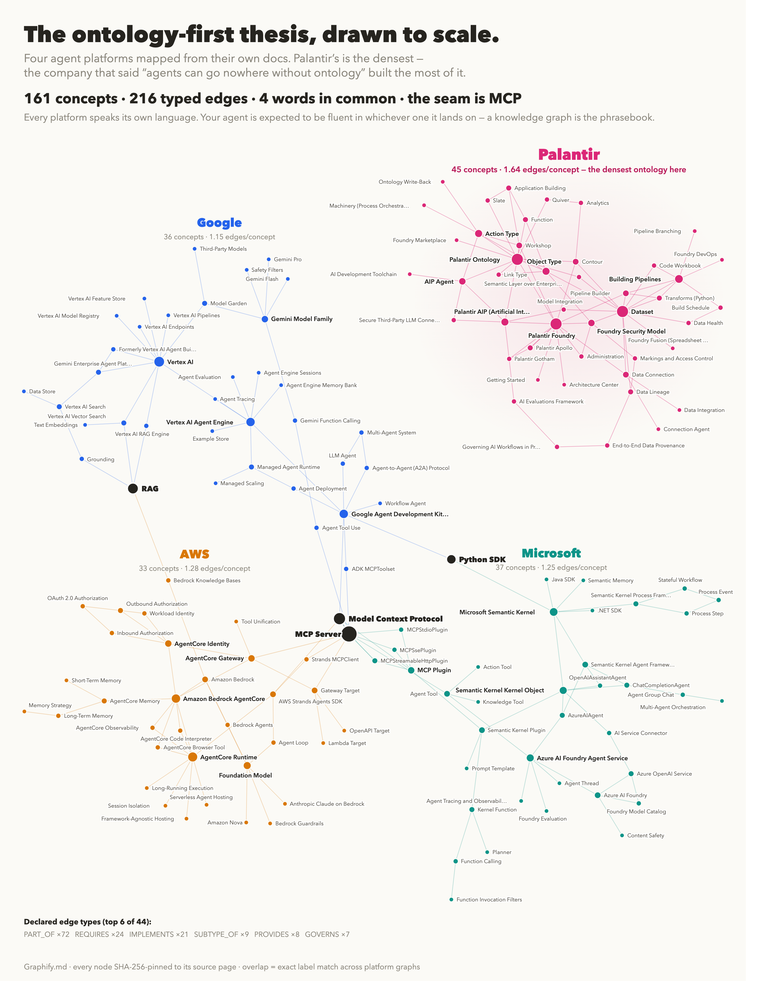

<!-- mcp-name: io.github.Yarmoluk/ckg-ai-platforms -->
# ckg-ai-platforms

[](https://pypi.org/project/ckg-ai-platforms/)
[](https://pypi.org/project/ckg-ai-platforms/)
[](server.json)
[](https://pypi.org/project/mcp/)
[](src/ckg_ai_platforms/domains)
[](src/ckg_ai_platforms/domains)
[](src/ckg_ai_platforms/domains)
[](LICENSE-CODE)
[](LICENSE)

AI developer and agent platforms as source-pinned, traversable Compressed Knowledge Graphs.

This package is a public MCP server. Install it, connect it to Claude Desktop or another MCP client, and the agent can search platform vocabulary, compare concepts across vendors, traverse typed relationships, and verify the source URL/hash behind a node.

No API key is required. The server runs locally over MCP stdio using the MCP Python SDK 2.x and does not phone home.

## Visual Atlas

[](https://yarmoluk.github.io/ckg-ai-platforms/)

The poster maps the four v0.3.0 agent-platform additions: AWS Bedrock AgentCore, Google's Gemini/Vertex agent stack, Microsoft's AI agent stack, and Palantir Foundry. That slice contains 161 concepts and 216 typed edges. The full MCP package includes 11 domains, 475 nodes, and 550 typed CSV edges.

[Open the GitHub Pages explainer](https://yarmoluk.github.io/ckg-ai-platforms/)

## What You Can Do

| Use case | MCP tool |
| --- | --- |
| List every packaged platform graph with counts and source coverage | `list_atlas()` |
| Search one platform for a concept | `search_concepts(query, domain)` |
| Compare vendor vocabulary across all graphs | `compare_platforms(query)` |
| Find where MCP appears inside platform docs | `find_mcp_touchpoints()` |
| Inspect a concept's direct typed relationships | `get_concept_context(concept, domain)` |
| Traverse the graph around a concept | `query_ckg(concept, domain, depth)` |
| Verify source provenance for a node | `verify_source(concept, domain)` |

Example questions this MCP is built to answer:

- "Where does MCP show up across AWS, Google, Microsoft, Anthropic, and Palantir?"
- "What does Palantir's ontology vocabulary connect to?"
- "How does AgentCore Gateway relate to MCP servers and gateway targets?"
- "Which platforms expose memory, tools, evaluation, or governance concepts?"
- "Show me the source hash for Semantic Kernel MCP Plugin."

## Included Graphs

| Domain | Nodes | Typed CSV edges | Coverage |
| --- | ---: | ---: | --- |
| `anthropic-sdk` | 44 | 43 | Claude API, messages, tool use, prompt caching, MCP adapters |
| `aws-bedrock` | 46 | 48 | Bedrock models, Converse API, agents, guardrails, knowledge bases |
| `aws-bedrock-agentcore` | 36 | 46 | AgentCore runtime, gateway, memory, identity, Strands, MCP |
| `google-gemini-agent-platform` | 40 | 46 | Gemini Enterprise Agent Platform, Vertex AI, ADK, A2A, MCP |
| `huggingface` | 46 | 49 | Hub, Transformers, PEFT/LoRA, TRL, Datasets, Inference |
| `langchain` | 48 | 50 | LCEL, Runnables, agents, tools, memory, LangSmith |
| `langgraph` | 42 | 51 | StateGraph, nodes, edges, checkpoints, cycles, HITL |
| `microsoft-ai-agent-stack` | 40 | 50 | Azure AI Foundry, Semantic Kernel, MCP plugins, agent tools |
| `openai-api` | 43 | 45 | Chat Completions, tools, structured outputs, assistants, embeddings |
| `palantir-foundry` | 45 | 74 | Foundry, AIP, ontology, object types, link types, provenance |
| `vertex-ai` | 45 | 48 | Vertex AI, Model Garden, Agent Builder, Vector Search, MLOps |

Total: 11 domains, 475 nodes, 550 typed CSV edges.

## Install

```bash
pip install ckg-ai-platforms
```

Run the MCP server directly:

```bash
uvx ckg-ai-platforms
```

## MCP Client Config

Claude Desktop / MCP-compatible clients:

```json
{
  "mcpServers": {
    "ai-platforms": {
      "command": "uvx",
      "args": ["ckg-ai-platforms"]
    }
  }
}
```

Then ask your client to call:

```text
list_atlas()
find_mcp_touchpoints()
compare_platforms("memory")
get_concept_context("AgentCore Gateway", "aws-bedrock-agentcore")
verify_source("MCP Plugin", "microsoft-ai-agent-stack")
```

## Python Use

```python
from ckg_ai_platforms import compare_platforms, get_concept_context, list_atlas

atlas = list_atlas()
print(atlas["totals"])

matches = compare_platforms("MCP")
print(matches["matches_by_domain"].keys())

context = get_concept_context("Palantir Ontology", "palantir-foundry")
print(context["outgoing_relationships"])
```

## Data Format

Each graph is a CSV in `src/ckg_ai_platforms/domains/`:

```csv
ConceptID,ConceptLabel,Dependencies,TaxonomyID,SourceURL,source_content_hash
1,Palantir Foundry,4:REQUIRES,T-PLATFORM,https://...,sha256:...
2,Palantir Ontology,1:PART_OF|10:IMPLEMENTS,T-ONTOLOGY,https://...,sha256:...
```

Dependency tokens use:

```text
target_id:RELATION_TYPE
target_id:RELATION_TYPE:confidence
target_id
```

If no relation type is supplied, the loader treats the edge as `REQUIRES`.

## Why This Matters

Agent platforms increasingly expose their own vocabulary for memory, tools, governance, orchestration, models, and protocols. A CKG turns that vocabulary into a small, inspectable map an agent can traverse before it guesses from prose.

The same pattern can be applied to life sciences, semantic layers, compliance controls, clinical trial schemas, policy manuals, and other relationship-heavy domains. This repo is the public agent-platform atlas; the ClinicalTrials.gov benchmark is a separate domain evaluation.

## Benchmark Context

The public CKG benchmark is separate from this package. It evaluates structural questions where the answer depends on declared relationships rather than fuzzy document lookup.

Headline result from the locked v0.6.2 benchmark: CKG reached 3.8x the Macro-F1 of the configured vanilla RAG baseline on the published structural harness.

Read the paper: <https://github.com/Yarmoluk/ckg-benchmark/blob/main/paper/main.pdf>

## Provenance

Every node includes a source URL and source hash captured at extraction time. Use:

```text
verify_source("AgentCore Gateway", "aws-bedrock-agentcore")
```

The hash is the trust anchor. The URL is a fetch hint, because live vendor docs can change.

## Project Status

Status: public, author-run, source-pinned atlas. Not independently replicated.

This repository is not affiliated with, sponsored by, or endorsed by LangChain, LangGraph, OpenAI, Anthropic, Hugging Face, AWS, Google, Microsoft, Palantir, or any listed platform vendor. All trademarks belong to their respective owners.

Built by [Graphify.md](https://graphifymd.com) / Daniel Yarmoluk. Patent pending.
